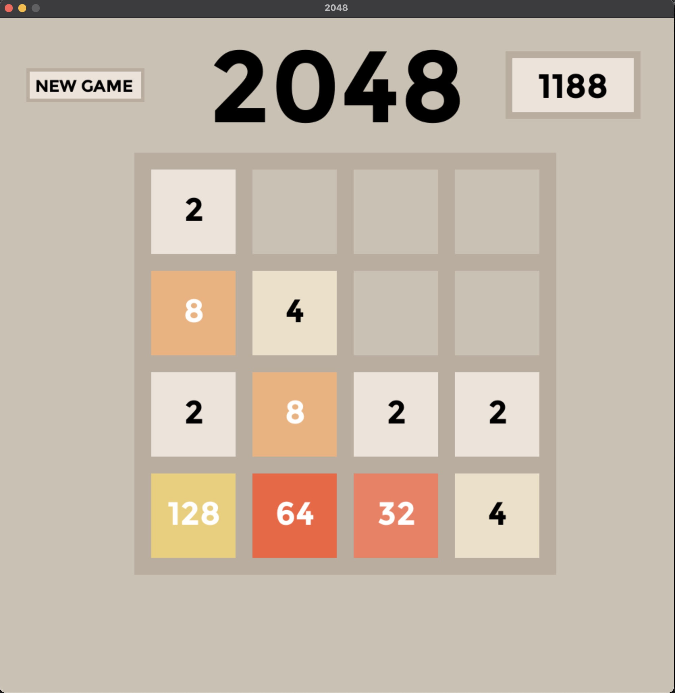

# 2048 Game

An implementation of the classic 2048 game using Python and the Pygame library

Future Plans:
-
- Enhance UI with more detail
- Implement different sized grids
- Create a competition against an AI opponent

